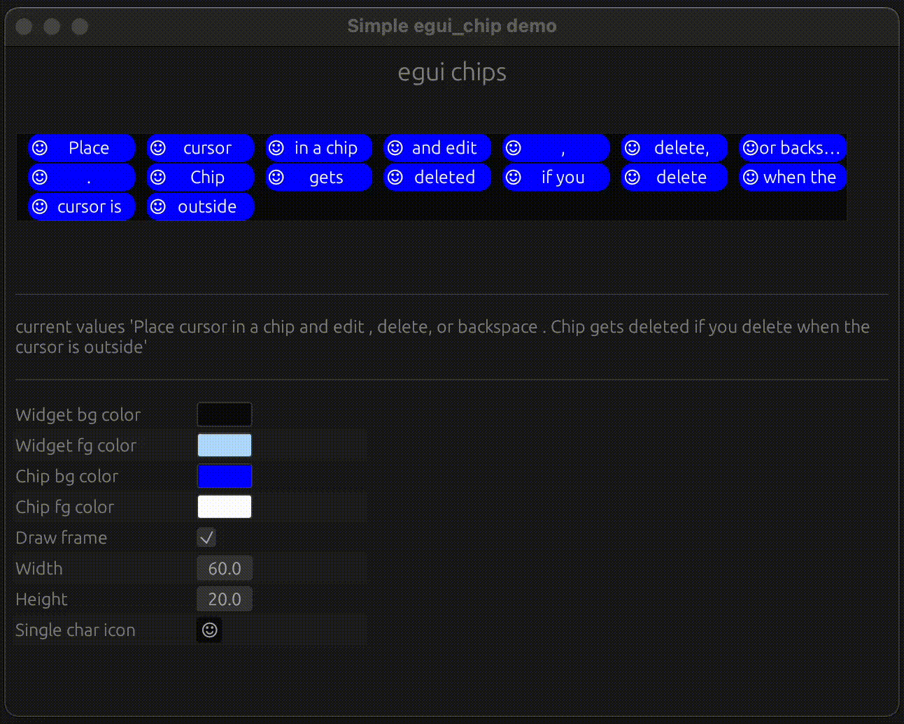

# egui_chip: compact component to display tags, selections, or actions

[](https://docs.rs/egui_chip)
[](https://github.com/vauradkar/egui_chip/actions?workflow=CI)
[](https://crates.io/crates/egui_chip)
[](<https://github.com/vauradkar/egui_chip/blob/main/LICENSE-MIT>)
[](<https://github.com/vauradkar/egui_chip/blob/main/LICENSE-APACHE>)

## Features

- Customizable options for appearance
- Supports moving from one chip to another
- Supports deleting chip with delete or backspace keys
- Integration with the `egui` framework

## Example

```rust
use egui_chip::ChipEditBuilder;

let chip_edit = ChipEditBuilder::new(", ")
    .unwrap()
    .frame(true)
    .texts(["hello", "world"])
    .build();
```

## Sample app

```shell
cargo run --example simple
```


